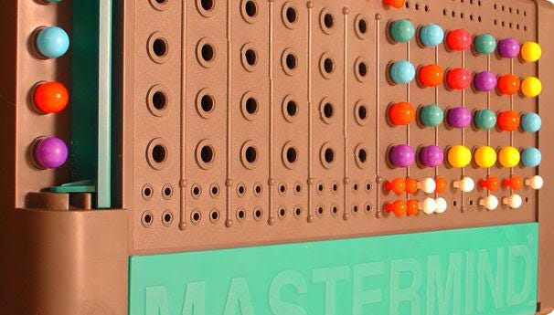
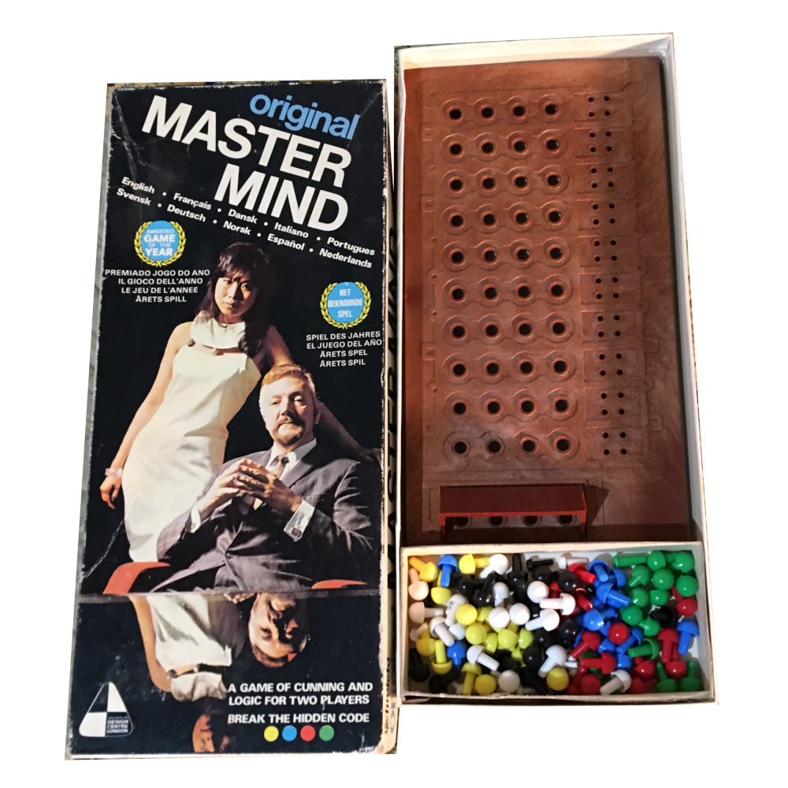
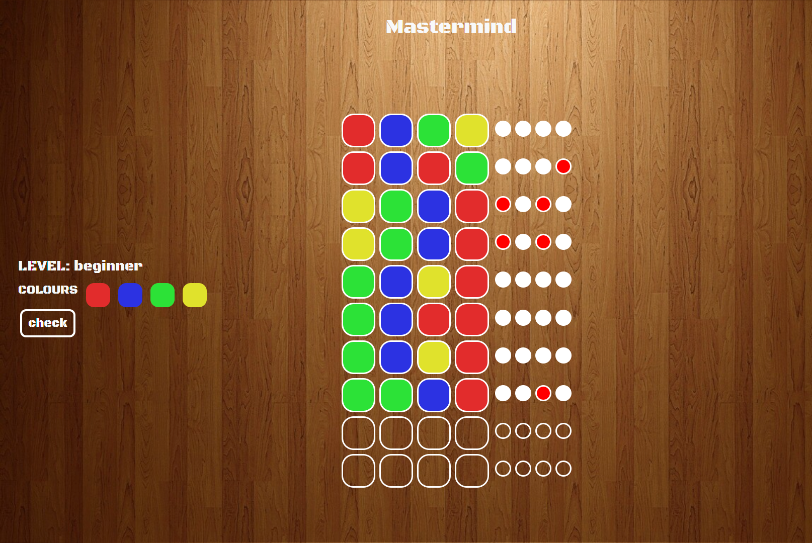

# Proyecto 3 (Mastermind)
 

### Contenido

- ### [¿Que es?](¿#Quees?)
- ### [Acerca de](#Acercade)
- ### [Desarrollo 🖥️](#Desarrollo)
- ### [Tecnologias Usadas 💻](#TecnologiasUsadas)
- ### [¿Como Jugar?🎮 ](#Comojugar)
- ### [Errores conocidos ](#Errores))
- ### [Repositorio Github 💾](#Repositorio)
- ### [Licencia y Copyright 📜](#Licencia)
- ### [Agradecimientos](#Agradecimientos)

---

### ¿Que es?

##### 
 Este proyecto esta basado en una version online del juego de mesa Mastermind,creado en un ambito educativo para GleeksHubs Academy. 
 

---

### Acerca de

##### 
Mastermind fue inventado en 1970 por Mordecai Meirowitz , un administrador de correos y experto en telecomunicaciones israelí . Después de presentar la idea a importantes empresas de juguetes y mostrarla en la Feria Internacional del Juguete de Nuremberg , fue adoptada por una empresa de plásticos, Invicta Plastics , con sede cerca de Leicester , Reino Unido . Invicta compró todos los derechos del juego y el fundador, Edward Jones-Fenleigh, perfeccionó aún más el juego. Fue lanzado en 1971.
##### 
Desde 1971, los derechos de Mastermind pertenecen a Invicta Plastics. (Invicta siempre llamó al juego Master Mind ). Originalmente lo fabricaron ellos mismos, aunque desde entonces han otorgado licencias de fabricación a Hasbro en todo el mundo, con la excepción de Pressman Toys y Orda Industries, que tienen los derechos de fabricación en los Estados Unidos e Israel, respectivamente.Chieftain Products adquirió los derechos de fabricación en Canadá en 1972 y cerró en 1996.
##### 
A partir de 1973, la caja del juego mostraba una fotografía de un hombre con chaqueta sentado en primer plano, con una joven asiática de pie detrás de él. Los dos modelos aficionados (Bill Woodward y Cecilia Fung) se reunieron en junio de 2003 para posar para otra fotografía publicitaria.

---

### Desarrollo

##### 
Para la realización de este proyecto se ha utlizado HTML5, CSS3,Javascript,siendo este último clave para el buen desarrollo del mismo. Gracias al cual, se ha conseguido desarrollar un juego plenamente funcional.
##### 
Ademas se ha incorporado Bootstrap 5 para garantizar la funcionalidad responsive. Aunque se ha adaptado para su visualización en dispositivos móviles, el enfoque principal del diseño se ha centrado en la versión de escritorio.
##### 
La página web cuenta con múltiples páginas enlazadas entre si, siendo estas la página principal, la de introducción del nombre,  elección de niveles, elección de colores, el propio juego, cómo jugar y la enhorabuena al ganador.

 

---

### Tecnologias Utilizadas

     

---

### ¿Como Jugar?

##### 
Mastermind es un juego de ingenio en el que tendremos que adivinar la combinación de 4 colores ganadora. Para empezar a jugar iremos a la página de inicio donde vemos dos botones, el primero será para iniciar una nueva partida y el segundo para conocer las reglas del juego. Los pasos a seguir para jugar son los siguientes:
##### 
 - Introduce tu nombre, aunque si nos saltamos esta parte el juego te llamará Player 1 por defecto. 
##### 
 - Elige el nivel de dificultad. En principiante jugaremos con 4 colores y tendremos 10 intentos, en el nivel medio jugaremos con 5 colores y tendremos 8 intentos y por último, en el nivel superior jugaremos con 6 colores durante 6 intentos.
##### 
 - Elegimos los colores con los que queremos jugar. Clicaremos en los rectángulos morados y gracias a un color picker podremos elegir una gran variedad de colores. Una vez elegidos clicaremos el botón de check para ir a la pantalla del tablero.
##### 
 - En esta pantalla veremos un recordatorio del nivel que hemos elegido y nuestros colores. Clicaremos en estos para empezar nuestra primera combinación y los cuadrados del tablero se irán pintando por orden. Una vez decidida la combinación que creamos ser la ganadora clicaremos en "check".
##### 
 - Si hemos   acertado tanto el color como la posición donde este se encuentra aparecerá un círculo rojo en la posición correcta. Si solo hemos adivinado el color aparecerá un círculo blanco. Si el color no existeen la combinacion el círculo no cambiará y seguirá siendo negro.
##### 
 - Ganaremos cuando adivinemos la combinación secreta, es decir cuando los cuatro círculos sean rojos. Por el contrario, habremos perdido si las filas se terminan.

 

---

### Erorres Conocidos

##### 
 - El diseño no es totalmente Responsive, no se muestra correctamente en algunas resoluciones.
##### 
 - Al finalizar la partida y no has ganado, no aparece la pantalla de Game Over.
##### 
 - Cuando elegimos el nombre del jugador este no se queda grabado en la pantalla del juego.

---

### Repositorio Github

https://github.com/Achoay/VFSTD2023proyecto3-Matermind-.git

---

### Licencia y Copyright
##### 
Este proyecto ha sido realizado por Cristian Lujan para el curso de Full Stack Developer de Geekhubs Academy,en la edicion de Septiembre de 2023,todo el contenido del repositorio se encuentra bajo la licemcia MIT.
##### 
Mastermind es actualmente una marca comercial propiedad de Pressman Toys.

---

### Agradecimientos
##### 
Agradecimientos a todo el equipo de Geekhubs Academy,especialmente a David Ochando y Dani Tarazona.
##### 
Por supuesto tambien agradecer a tod@s mis compañer@s por la ayuda prestada al a hora de resolver dudas,gracias a tod@s. 

